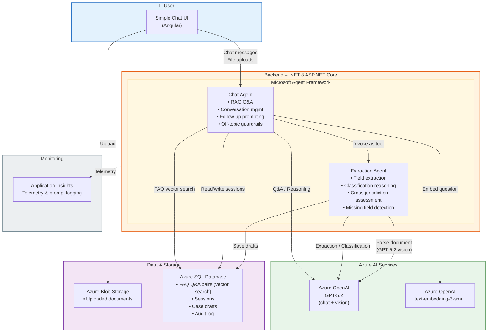

# Compliance Agent – Architecture Diagram

```mermaid
flowchart TB
    subgraph User["👤 User"]
        UI["Simple Chat UI<br/>(Angular)"]
    end

    subgraph Backend["Backend – .NET 8 ASP.NET Core"]
        subgraph AgentFramework["Microsoft Agent Framework"]
            ChatAgent["Chat Agent<br/>• RAG Q&A<br/>• Conversation mgmt<br/>• Follow-up prompting<br/>• Off-topic guardrails"]
            ExtractionAgent["Extraction Agent<br/>• Field extraction<br/>• Classification reasoning<br/>• Cross-jurisdiction assessment<br/>• Missing field detection"]
        end
    end

    subgraph AzureAI["Azure AI Services"]
        AOAI["Azure OpenAI<br/>GPT-5.2<br/>(chat + vision)"]
        Embeddings["Azure OpenAI<br/>text-embedding-3-small"]
    end

    subgraph Storage["Data & Storage"]
        Blob["Azure Blob Storage<br/>• Uploaded documents"]
        SQLDB["Azure SQL Database<br/>• FAQ Q&A pairs (vector search)<br/>• Sessions<br/>• Case drafts<br/>• Audit log"]
    end

    subgraph Monitoring["Monitoring"]
        AppInsights["Application Insights<br/>Telemetry & prompt logging"]
    end

    UI -- "Chat messages<br/>File uploads" --> ChatAgent
    ChatAgent -- "Invoke as tool" --> ExtractionAgent

    ChatAgent -- "Q&A / Reasoning" --> AOAI
    ExtractionAgent -- "Extraction / Classification" --> AOAI

    ChatAgent -- "Embed question" --> Embeddings
    ChatAgent -- "FAQ vector search" --> SQLDB

    ExtractionAgent -- "Parse document<br/>(GPT-5.2 vision)" --> AOAI
    UI -- "Upload" --> Blob

    ChatAgent -- "Read/write sessions" --> SQLDB
    ExtractionAgent -- "Save drafts" --> SQLDB

    Backend -. "Telemetry" .-> AppInsights

    style User fill:#E3F2FD,stroke:#1565C0
    style Backend fill:#FFF3E0,stroke:#E65100
    style AgentFramework fill:#FFF8E1,stroke:#F9A825
    style AzureAI fill:#E8F5E9,stroke:#2E7D32
    style Storage fill:#F3E5F5,stroke:#6A1B9A
    style Monitoring fill:#ECEFF1,stroke:#546E7A
```
